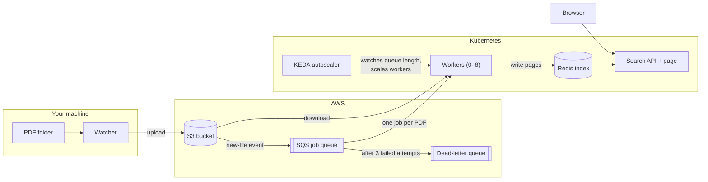
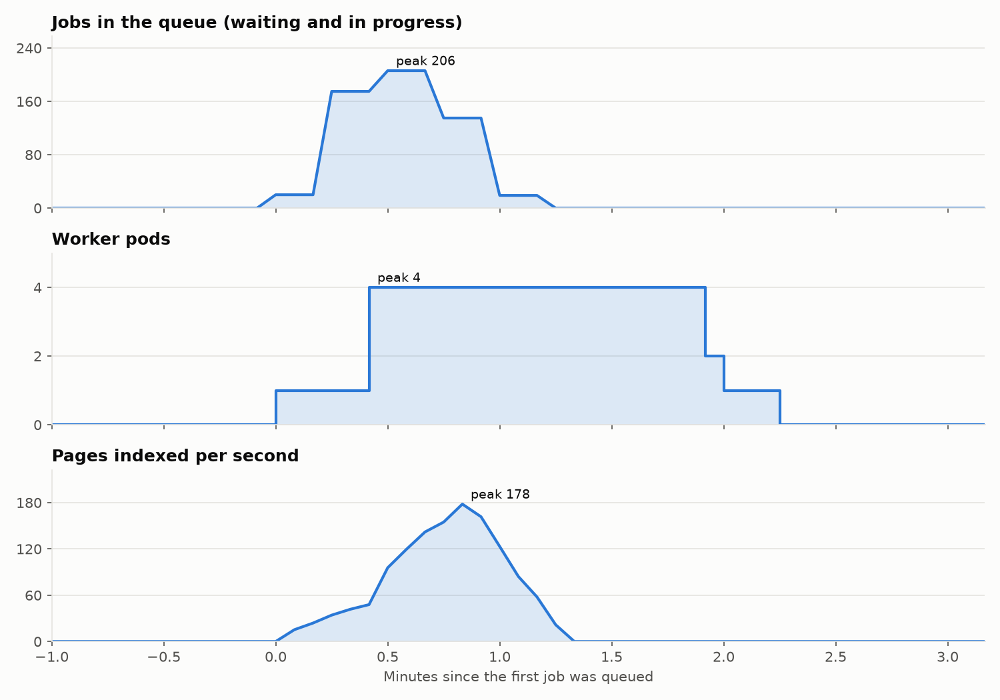

# Distributed PDF Search

[](https://github.com/ahmet-cskn/scalable-pdf-manager/actions/workflows/ci.yml)

- Drop PDFs into a folder and search their full text, quickly and reliably.
- The app uses a distributed pipeline with Kubernetes, Amazon S3 and SQS for processing large loads of PDFs being dropped to the folder at once.
- Once the PDFs are processed, the user can search for any string they like, and the PDFs in which the string appears as a substring and the page numbers are returned instantly.
- The querying mechanism uses a trigram-based technique to efficiently and swiftly fetch the relevant pages.

## Demo

Below is a live demo of the application on my own MacBook Air M1, at 8x speed. Here is a walkthrough of what happens (I will call the top left, top right, bottom left, and bottom right terminals window 1, 2, 3, and 4 for simplicity):

1. In window 4, I run a command that generates 300 PDFs at once in the folder being watched.
2. The watcher uploads the PDFs to S3, as observed in window 1.
3. As the PDFs are being uploaded, a worker spawns, as observed in window 2.
4. The PDFs start being processed by the single worker. The “processing” file count alternates between 0 and 1, as observed in window 3.
5. Shortly after, the worker count scales up to 4 workers, and multiple files start being processed at once (I set the worker limit to 4 workers due to hardware constraints of my MacBook).
6. As the queue shrinks, KEDA scales the workers back down, step by step after a short delay, until none are left.

https://github.com/user-attachments/assets/4b236731-b8cf-4f6f-9e46-71596f9dd3a4

## Architecture



1. The watcher notices new PDFs in the folder and uploads them to S3.
2. For every new file, S3 itself puts a job on an SQS queue. Uploading and processing are fully decoupled. The queue acts as a buffer between uploading and processing.
3. Workers take one job at a time, download the PDF, extract the text of each page and write it into the Redis index.
4. KEDA watches the queue length and adds or removes workers.
5. A file whose upload is complete and indexed by a worker can be queried from the web UI through the Redis index.

**How the search works:**
Every page is split into overlapping three-letter chunks (trigrams). For instance, “network” contains net, etw, two, wor, ork. Redis has [trigram] : [set of pages containing that trigram] pairs. A query is split the same way and pages that contain all trigrams of the query are selected as candidates. Candidates are scanned to see if they contain the exact text. This method efficiently finds substrings without scanning every page.

## Handling scale and failure

- **No job is lost.** A worker only hides a job while it works on it and deletes it once the page index is written. If the worker crashes, the job reappears and another worker takes it. For long PDFs the worker keeps extending the hiding time, so no second worker starts on the same file.
- **Duplicates are harmless.** S3 events and SQS deliver at least once, so a file can occasionally be processed twice. The index writes are idempotent (adding a page to a set twice changes nothing), which is simpler and more robust than trying to guarantee exactly once processing.
- **Broken files don't block the queue.** After 3 failed attempts SQS moves a job to a dead-letter queue, and the file is marked as failed.
- **Elastic and graceful.** Workers are stateless and scale between 0 and 8 (though a smaller worker count limit can be chosen. I chose the limit to be 4 in my demo run, due to my laptop's capabilities). When Kubernetes removes one, it finishes its current file first.
- **Least privilege.** Each component has its own AWS identity with only the permissions it needs: the watcher can upload but not read the queue, KEDA can only read the queue length.

## Results

All measurements were taken on a MacBook Air M1, with every component except S3 and SQS running on the laptop.

### Autoscaling

This chart shows the demo run above, measured with Prometheus. Read it from top to bottom:



- **Top:** as the 300 PDFs are uploaded, jobs pile up in the queue (up to 206 at once), then the workers empty it.
- **Middle:** KEDA starts 1 worker within seconds and adds more until the limit of 4 is reached. Once the queue is empty, it removes them step by step.
- **Bottom:** throughput rises with the number of workers, peaking at 178 pages per second. All 6,644 pages were indexed in about 80 seconds.

### More workers, more speed

A benchmark script indexes the same 150 PDFs with 1 to 6 workers (3 runs each, median shown):


- **Left:** throughput grows from 53 pages per second with 1 worker to 186 with 6. The dashed line is perfect scaling (6 workers being 6× as fast); the measured curve stays close to it up to 3 workers and reaches 3.5× at 6.
- **Right:** where a worker's time per page goes. With 1 worker, about two thirds of it is waiting on the network (receiving the job, downloading the PDF, deleting the job), and extracting the text takes only about 1 ms. With more workers, the `index` phase (preparing the writes to Redis) grows because the workers share the laptop's CPU.

What the measurements show:

- **The workers are not slowed down by the database.** Redis used at most 30% of one CPU core and would only become the limit at around 600 pages per second. Splitting the index across several Redis instances was planned, but the numbers showed it would not help yet, so it was not built.
- **The limit is the laptop.** Beyond 3 workers they compete for the M1's 4 fast CPU cores, which is why the curve flattens. On separate machines, adding workers should keep adding speed until Redis' limit of around 600 pages per second.

## Tech stack

| Area | Technologies |
|---|---|
| Language | Python 3.13 |
| Frameworks and Libraries | FastAPI, PyMuPDF |
| AWS | S3, SQS (with dead-letter queue), IAM, Budgets |
| Orchestration | Kubernetes (kind), KEDA, Helm, Docker |
| Data | Redis (sets, pipelines, transactions, append-only persistence) |
| Infrastructure as code | Terraform |
| Observability | Prometheus |
| Quality | pytest, ruff, GitHub Actions CI |

## Running it yourself

Index and search a folder of PDFs locally, without AWS (requires [uv](https://docs.astral.sh/uv/) and Docker):

```bash
docker compose up -d --wait               # Redis
uv sync                                   # dependencies
uv run pdfsearch-index path/to/pdfs       # index a folder
uv run uvicorn pdfsearch.api:app          # search page at http://localhost:8000
```

[docs/SETUP.md](docs/SETUP.md) covers the full system: the AWS infrastructure with Terraform, the Kubernetes cluster with autoscaling, and the benchmark.

## License

[GNU Affero General Public License v3.0](LICENSE)
