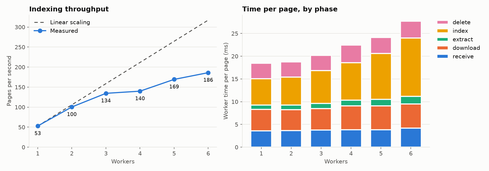

# scalable-pdf-manager

[](https://github.com/ahmet-cskn/scalable-pdf-manager/actions/workflows/ci.yml)

Distributed PDF indexing and substring search.

Drop a batch of PDFs into a folder: they are uploaded to Amazon S3, queued through Amazon SQS, and processed by an autoscaling pool of Kubernetes workers that extract each page's text into a Redis trigram index. A query service then returns every `(file, page)` whose text contains a given string.

**Stack:** Python · Amazon S3 · Amazon SQS · Redis · Kubernetes (kind) · KEDA · Terraform · FastAPI · Prometheus

> See [docs/DESIGN.md](docs/DESIGN.md) for the full design and [the benchmark](#benchmark) for measured throughput.

## Run locally

Requirements: [uv](https://docs.astral.sh/uv/) and Docker.

```bash
# Start Redis
docker compose up -d --wait

# Install dependencies (uv also installs the right Python version)
uv sync

# Index a folder of PDFs (single process)
uv run pdfsearch-index path/to/pdfs

# Start the query service, then open http://localhost:8000
uv run uvicorn pdfsearch.api:app --reload
```

The API is documented interactively at http://localhost:8000/docs.

| Endpoint | Description |
|---|---|
| `GET /` | Search page |
| `GET /search?q=<query>` | Pages containing the query (`400` if shorter than 3 characters after normalization) |
| `GET /status` | Number of files processing, done and failed |

## AWS infrastructure

The S3 bucket, SQS queues, IAM users and budget alert are defined with Terraform in [`infra/`](infra/). Requirements: the [AWS CLI](https://aws.amazon.com/cli/) and [Terraform](https://developer.hashicorp.com/terraform/install).

```bash
aws login --profile <your-profile>      # temporary credentials, no stored keys
export AWS_PROFILE=<your-profile>

cd infra
cp terraform.tfvars.example terraform.tfvars   # then set your alert email
terraform init
terraform apply
```

`terraform output` prints the bucket name and queue URLs. Terraform state stays local and is git-ignored.

## Run the pipeline against AWS

Each component has its own least-privilege IAM user. Create access keys for the worker and the watcher once and store them as CLI profiles, without printing the secrets (zsh):

```bash
for C in worker watcher; do
  aws iam create-access-key --user-name pdfsearch-$C --profile <your-profile> \
    --query 'AccessKey.[AccessKeyId,SecretAccessKey]' --output text \
    | read -r KEY SECRET \
    && aws configure set aws_access_key_id "$KEY" --profile pdfsearch-$C \
    && aws configure set aws_secret_access_key "$SECRET" --profile pdfsearch-$C \
    && aws configure set region eu-north-1 --profile pdfsearch-$C
done; unset KEY SECRET
```

Then run each component in its own terminal (Redis must be running):

```bash
# 1. Query service: http://localhost:8000
uv run uvicorn pdfsearch.api:app

# 2. Worker: indexes uploaded PDFs
AWS_PROFILE=pdfsearch-worker \
QUEUE_URL=$(terraform -chdir=infra output -raw queue_url) \
uv run pdfsearch-worker

# 3. Watcher: uploads PDFs dropped into inbox/ (git-ignored)
mkdir -p inbox
AWS_PROFILE=pdfsearch-watcher \
uv run pdfsearch-watch inbox --bucket $(terraform -chdir=infra output -raw bucket_name)
```

Copy PDFs into `inbox/`; they become searchable within seconds. The watcher uploads each file once (files already in the bucket are skipped, also after a restart), ignores subfolders and hidden files, and only accepts names ending in `.pdf` or `.PDF`.

Worker and watcher stop gracefully on Ctrl+C (press twice to stop immediately). See `pdfsearch.worker.main` and `pdfsearch-watch --help` for all settings.

## Run on Kubernetes with autoscaling

Redis, the query service and the workers run in a local [kind](https://kind.sigs.k8s.io/) cluster; [KEDA](https://keda.sh/) scales the workers between 0 and 8 based on the SQS queue length. The watcher stays on the host. Requirements: kind, kubectl, Helm, and the AWS setup and CLI profiles from the previous sections (including one for `pdfsearch-keda`).

```bash
make cluster          # create the kind cluster
make monitoring       # install Prometheus
make keda             # install KEDA
make image            # build the Docker image and load it into the cluster
make worker-secret    # AWS keys from the pdfsearch-worker / pdfsearch-keda
make keda-secret      #   profiles, stored as Kubernetes Secrets
make deploy           # Redis, API, worker and the scaling rule
```

The search page is at http://localhost:8080. Start the watcher as above, then drop a large batch of generated PDFs into the inbox and watch the workers scale up, and back to zero once the queue is empty:

```bash
kubectl --context kind-pdfsearch -n pdfsearch get pods -l app=worker -w

uv run pdfsearch-generate inbox --count 1000 --prefix batch-
```

Once the workers are back at zero, `uv run python scripts/autoscaling.py` charts the run from Prometheus (queue length, workers and throughput over time) into `docs/benchmark/autoscaling.png`.

`make help` lists all targets; `make restart` rebuilds the image and rolls out new pods after a code change; `make prometheus` opens Prometheus at http://localhost:9090; [docs/METRICS.md](docs/METRICS.md) has ready-made queries.

## Benchmark

Indexing throughput by number of workers: 150 generated PDFs (3,183 pages) per run, all queued before exactly N workers start, median of 3 runs. Measured on the kind cluster on a MacBook Air (Apple M1: 4 performance + 4 efficiency cores; Docker limited to 8 CPUs and 5 GB), against S3 and SQS in `eu-north-1`.



| Workers | Pages/s | Speedup | Worker CPU per page | `index` phase per page |
|---|---|---|---|---|
| 1 | 53 | 1.0× | 6.0 ms | 5.8 ms |
| 2 | 100 | 1.9× | 5.5 ms | 6.2 ms |
| 3 | 135 | 2.5× | 6.3 ms | 7.2 ms |
| 4 | 140 | 2.6× | 8.0 ms | 8.3 ms |
| 5 | 169 | 3.2× | 9.9 ms | 10.1 ms |
| 6 | 186 | 3.5× | 11.8 ms | 12.8 ms |

What the per-phase metrics show:

- **Workers mostly wait on AWS.** With one worker, receiving the job, downloading the PDF and deleting the job take ~12 of ~18.5 ms per page; extracting the text takes ~1 ms. Workers are I/O-bound, which is why adding them helps even on one machine.
- **Redis is not the bottleneck.** It spends 2.2 µs per `SADD`, ~1.7 ms per page (~750 trigrams), and used at most 0.3 of its single core.
- **Scaling flattens because of the laptop's CPU.** Worker CPU time per page is flat at ~6 ms up to 3 workers and doubles to ~12 ms at 6: the M1 has 4 fast cores, shared with Redis, Prometheus and Kubernetes, and further work runs on its slower efficiency cores. The phase that grows most, `index`, is mostly CPU work in the worker (the Redis client encoding ~750 commands and parsing the replies per page), not time in Redis.
- **8 workers no longer fit** next to Prometheus in 5 GB: the node starts swapping and health checks fail.

The full analysis and its limits are in [docs/DESIGN.md §9](docs/DESIGN.md#9-capacity-estimates). To reproduce: `uv run python scripts/benchmark.py --repeat 3` with the cluster deployed (every run is kept in [`docs/benchmark/runs.csv`](docs/benchmark/runs.csv)).

## Development

```bash
uv run pytest           # tests (need Redis running)
uv run ruff check .     # lint
uv run ruff format .    # format
```

Tests use Redis database 15 and clear it on every run; indexed data lives in database 0.

## License

[GNU Affero General Public License v3.0](LICENSE)
