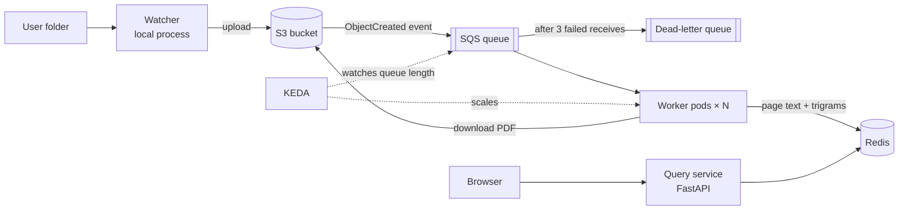

# Design Document

## 1. Overview

**scalable-pdf-manager** indexes large batches of PDF files and answers substring queries over their text.

A user drops PDFs (potentially thousands) into a folder. The files are uploaded to Amazon S3, which emits an event per file into an Amazon SQS queue. A horizontally autoscaled pool of worker pods on Kubernetes consumes the queue, extracts the text of every page, and writes it into a trigram index in Redis. A query service answers: *"which (file, page) pairs contain this string?"*

### 1.1 Goals

- Return **exactly** the set of `(file, page)` pairs whose normalized text contains the normalized query as a substring.
- Ingest large batches in parallel; throughput scales with the number of workers.
- No file is lost when a worker crashes; reprocessing a file is harmless.
- Infrastructure is reproducible (Terraform) and runs at near-zero cost.

### 1.2 Non-goals (current scope)

- Matches that span a page boundary.
- OCR for scanned PDFs (pages without a text layer are indexed as empty).
- Ligature handling, re-joining words hyphenated across line breaks.
- Languages other than English; non-ASCII characters are discarded.
- Result snippets or match positions.
- Updating or deleting files once indexed.
- Pagination or result caps.

## 2. Architecture



| Component | Runs on | Responsibility |
|---|---|---|
| Watcher | Laptop (plain Python process) | Detect new PDFs in the folder and upload them to S3 |
| S3 bucket | AWS (`eu-north-1`) | Durable storage for PDFs; emits an event per upload |
| SQS queue + DLQ | AWS | Distributes one job per file to workers; isolates poison messages |
| Workers | kind cluster (Deployment) | Download, extract, normalize, index |
| KEDA | kind cluster | Scales workers on SQS queue length (0 ↔ N) |
| Redis | kind cluster (StatefulSet, AOF) | Trigram index, page texts, file status |
| Query service | kind cluster (Deployment) | HTTP search API + minimal search page |
| Prometheus | kind cluster | Metrics from workers, API, Redis, KEDA and the kubelet |

## 3. Ingestion pipeline

### 3.1 Watcher

- Watches a single local folder for new `*.pdf` files.
- **Stability check:** a file is uploaded only after its size has stopped changing for ~2 s (the OS reports files before a copy completes).
- Uploads with the filename as the S3 key. Large files use multipart upload (handled by the AWS SDK).
- **Startup sync:** lists the bucket and uploads only local files that are missing, covering files dropped while the watcher was down.
- The watcher does **not** create jobs; S3 does. Any upload path (watcher, `aws s3 cp`, console) triggers indexing.
- Filenames are unique because they come from a single folder.

### 3.2 S3 → SQS

- The bucket is private (public access blocked) with default encryption.
- An event notification on `s3:ObjectCreated:*` with suffix filters `.pdf` and `.PDF` (filters are case-sensitive; mixed case like `.Pdf` is not matched) delivers to an SQS **standard** queue (ordering is not needed, so FIFO is not used).
- A queue policy allows `sqs:SendMessage` only from the S3 service on behalf of this bucket in this account (`aws:SourceArn`, `aws:SourceAccount`), and denies non-TLS access.
- Redrive policy: after **3** receives, a message moves to the DLQ (14-day retention).

### 3.3 Worker

```
loop:
    msg = sqs.receive(max_messages=1, wait_time=20s)        # long polling
    if msg is s3:TestEvent: delete, continue
    key = url_decode(msg.Records[0].s3.object.key)          # S3 URL-encodes keys
    set status(key) = processing
    pdf = s3.download(key)
    for each page (1-based):                                # visibility heartbeat runs meanwhile
        index_page(key, page, extract(page))                # normalizes, then §4.4
    set status(key) = done, pages = n
    sqs.delete(msg)

on error:
    if msg.ApproximateReceiveCount >= 3: set status(key) = failed
    do not delete → SQS redelivers it, or moves it to the DLQ
```

- **One message per receive**, so idle workers are never starved by a busy one.
- **Visibility timeout** 5 min; a background heartbeat calls `ChangeMessageVisibility` every 60 s while a file is processing, so a long PDF is never handed to a second worker mid-processing.
- **Delete after write:** the message is deleted only after all Redis writes for the file succeed.
- **Graceful shutdown:** on `SIGTERM` the worker stops receiving, then either finishes the current file or exits without deleting (the message reappears after the visibility timeout).
- **Stateless:** all state lives in SQS, S3, or Redis, so workers can be added or removed at any time.
- Text extraction uses **PyMuPDF**.

### 3.4 Delivery semantics

Both S3 event notifications and SQS standard queues are **at-least-once**: a file may be processed more than once. Correctness relies on the index writes being idempotent (§4.4), not on exactly-once delivery.

### 3.5 Autoscaling

KEDA's `aws-sqs-queue` scaler drives the worker Deployment:

- Target: ~10 messages per worker.
- Min replicas: 0 (scale to zero when idle). Max replicas: configurable (default 20).

### 3.6 Progress tracking

Workers maintain per-file status in Redis (§4.3). Pending files are visible as the SQS queue length; failed files are visible both in Redis and in the DLQ. The query service exposes aggregate counts.

## 4. Search

### 4.1 Normalization

One shared function, applied identically to page text and to queries:

1. Lowercase.
2. Replace every character outside `[a-z0-9]` with a space.
3. Collapse runs of spaces into one.
4. Trim.

| Input | Normalized |
|---|---|
| `Hello, Everyone!` | `hello everyone` |
| `don't` | `don t` |
| `café` | `caf` |
| `C++` | `c` |

Queries whose normalized form is shorter than 3 characters are rejected.

### 4.2 Trigrams

- Sliding window of size 3 over the normalized text, **including spaces** (`"hello every"` yields `"o e"`, `" ev"`, …).
- De-duplicated into a set per page (and per query).
- Text shorter than 3 characters yields no trigrams.

### 4.3 Data model (Redis)

| Key | Type | Content |
|---|---|---|
| `page:<file>#<page>` | String | Normalized text of the page |
| `tri:<trigram>` | Set | Page ids (`<file>#<page>`) containing the trigram |
| `file:<file>` | Hash | `status` (`processing` / `done` / `failed`), `pages` |
| `files:<status>` | Set | Filenames currently in that status (for counts) |

- Page id: `<file>#<page>`, page numbers 1-based. Parsed by splitting on the **last** `#` (filenames may contain `#`).
- Status changes update `file:<file>` and move the filename between `files:<status>` sets in one `MULTI` transaction.
- Persistence: **AOF** enabled.

### 4.4 Write path (per page)

One pipelined batch:

1. `SET page:<id> <text>` — **first**.
2. `SADD tri:<t> <id>` for every trigram of the page.

Properties:

- **Concurrent writers are safe:** Redis executes commands one at a time and each command is atomic; no application-level locking.
- **Idempotent:** re-setting the same text and re-adding an existing set member are no-ops, so redelivered files cannot corrupt the index.
- **Crash-safe:** a partially written page is completed when the file is redelivered.
- **Text before trigrams:** a page can never become a search candidate without its text being available for verification.

### 4.5 Query path

1. Normalize the query; reject if shorter than 3 characters.
2. Compute the query's trigram set.
3. `SINTER tri:<t1> tri:<t2> …` → candidate pages (Redis iterates the smallest set; a missing key yields an empty result).
4. `MGET page:<id> …` → candidate texts in one round trip.
5. Keep candidates whose text contains the normalized query.
6. Sort by filename, then page number; return `[{file, page}, …]`.

**Correctness:** the trigram filter may produce false positives but never false negatives; step 5 removes the false positives, so results are exact.

### 4.6 API

| Endpoint | Description |
|---|---|
| `GET /` | Minimal HTML page with a search box |
| `GET /search?q=<query>` | `200` with `{"query": …, "results": [{"file": …, "page": …}]}`; `400` if the normalized query is shorter than 3 characters |
| `GET /status` | Counts of files per status |
| `GET /livez` | Liveness probe: the process is running (no dependencies) |
| `GET /readyz` | Readiness probe: `200` if Redis answers, else `503` |

## 5. Scaling phases

### 5.1 v1 — single Redis

All workers write directly to one Redis instance; one query service reads from it.

### 5.2 v2 — sharded by file

- N **independent** Redis instances; a file belongs to shard `hash(filename) % N`. All keys of a file (pages, trigram memberships, status) live on its shard.
- Workers route writes by filename.
- The query service fans out each query to all shards in parallel; each shard runs steps 3–5 of §4.5 locally; results are merged and sorted.
- **Why not Redis Cluster:** it partitions keys by key hash, i.e. by trigram. `SINTER` across keys on different nodes fails (`CROSSSLOT`), and verification would need page text from other nodes. Partitioning by document keeps every query step shard-local.
- **Limitation:** changing N requires re-indexing.
- **Motivation:** write throughput (a single Redis becomes the bottleneck with enough workers) and fault isolation — not storage size. Measured (§9): one Redis core would only limit indexing at roughly 600 pages/s, about 3× what 6 workers reached on the development laptop.

## 6. Infrastructure and deployment

- **AWS** (Terraform, `infra/`, region `eu-north-1`): S3 bucket, SQS queue, DLQ, S3→SQS notification and queue policy, IAM users and least-privilege policies, AWS Budgets alert (~$5/month).
- **Region:** the account uses AWS's project-based account experience, which pins each project to one Region by contact country (`eu-north-1` for Europe). `eu-central-1` was the original choice; the difference is a few milliseconds of latency, which is irrelevant for file uploads and downloads.
- **Operator credentials:** `aws login` (temporary credentials, no long-lived keys on the developer machine); Terraform reads them via `AWS_PROFILE`.
- **IAM (least privilege):**

  | Identity | Permissions |
  |---|---|
  | watcher | `s3:PutObject`, `s3:ListBucket` on the bucket |
  | worker | `s3:GetObject` on the bucket; `sqs:ReceiveMessage`, `sqs:DeleteMessage`, `sqs:ChangeMessageVisibility` on the queue |
  | keda | `sqs:GetQueueAttributes` on the queue |

- **Secrets:** access keys are created with the AWS CLI (not Terraform, so they never land in Terraform state), stored as Kubernetes Secrets, and never committed. Terraform state is local and git-ignored.
- **Kubernetes:** local **kind** cluster. Plain YAML manifests for project services; KEDA and Prometheus (kube-prometheus-stack) installed via Helm.
- **Development:** Docker Compose provides a local Redis; moto fakes S3 and SQS in-process for automated tests.

## 7. Observability

Prometheus (kube-prometheus-stack, trimmed to Prometheus and its operator) scrapes, every 5 s:

| Source | Metrics |
|---|---|
| Workers (`/metrics`, port 9100) | jobs by outcome, files and pages indexed, time per job phase (receive, download, extract, index, delete), busy |
| Query service (`/metrics`) | requests and latency per route template, search candidates vs. matches, search time per phase (intersect, verify) |
| Redis (`redis_exporter` sidecar) | commands processed, CPU time, memory |
| KEDA operator | the queue length it scales on (`keda_scaler_metrics_value`) |
| kubelet (cAdvisor) | CPU and memory per container |

Labels are bounded (route templates, phases, outcomes), never filenames or raw URLs, to keep the number of time series small.

Grafana was dropped: on the development laptop (8 cores, 5 GB for Docker) its startup repeatedly overloaded the node, and failing health checks turned that into restart loops. Metrics are explored in Prometheus' UI (`make prometheus`), with ready-made queries in [METRICS.md](METRICS.md), and plotted by the benchmark script.

**Benchmark caveat:** all pods share one laptop, so throughput flattens once the work exceeds its 4 performance cores; see §9 for the measurements and their analysis.

## 8. Testing strategy

- **Unit tests:** `normalize` and `trigrams` (punctuation, whitespace runs, non-ASCII, short strings).
- **Brute-force equivalence:** index generated pages; for many queries, results must equal a naive substring scan over all pages.
- **Idempotency:** indexing the same file twice leaves the index unchanged.
- **Concurrency:** many concurrent writers produce the same index as a single writer.
- **Integration:** S3/SQS paths tested against moto (in-process fakes; LocalStack has required an account and auth token since March 2026), plus manual end-to-end runs against real AWS.
- **Test data:** generated PDFs with known content; real lecture slides for manual end-to-end testing.
- **CI:** GitHub Actions runs lint (ruff) and tests on every push, with Redis as a service container, and checks Terraform formatting and validity (no AWS credentials in CI).

## 9. Capacity estimates

| Quantity | Initial estimate | Measured (generated PDFs) |
|---|---|---|
| PDFs | ~1,000 | 1,033 |
| Pages | ~30,000 | ~22,700 (~22 per PDF) |
| Normalized text | ~90 MB | — |
| Index size (Redis memory) | a few hundred MB | **686 MB** for the 1,033 PDFs |
| Extraction | ~10–50 ms/page → ~5–25 min on one core (the bottleneck) | **~1 ms/page** in a worker — not the bottleneck |
| Index writes | ~1,500 unique trigrams/page → ~45M `SADD` members, ~1 min of Redis time pipelined | ~750 unique trigrams/page; 2.2 µs per `SADD` → ~1.7 ms of Redis time per page |
| Throughput, 1 worker | — | 53 pages/s (benchmark, median of 3 runs) |
| Throughput, 6 workers | — | 186 pages/s, 3.5× of 1 worker |
| End-to-end demo, 8 workers, no Prometheus | — | ~60 pages/s (1,000 PDFs in ~6 min, milestone 6) |

**Index size.** Most of the memory is in the trigram sets: every page id is stored as a full string (`batch-0500.pdf#12`, ~20 bytes) in each of its page's ~750 trigram sets, i.e. tens of millions of set members. Storing short integer page ids instead (with one mapping from id to `<file>#<page>`) would shrink the sets several-fold and let Redis use its compact integer-set encoding. Until then, Redis in Kubernetes has a 2 GiB memory limit, which also leaves room for the temporary extra memory of rewriting the AOF file.

**Restart time.** On startup Redis loads its last snapshot and then replays every write logged since. Right after indexing the 1,000-PDF batch, that replay took ~140 s (the snapshot itself loaded in ~4 s); after Redis compacted the log, a restart took ~30 s. Restart time therefore depends on how much was written since the last compaction, which Redis triggers automatically as the log grows.

**Throughput** (benchmark: `scripts/benchmark.py`, results in [`docs/benchmark/`](benchmark/) and the README). Each run queues the same 150 generated PDFs (3,183 pages) before exactly N workers start, so upload speed and autoscaling delay are excluded; the reported values are medians of 3 runs. Throughput rises from 53 pages/s (1 worker) to 186 pages/s (6 workers): near-linear up to 3 workers, 3.5× at 6. The per-phase metrics explain the shape:

- *Workers are I/O-bound.* With one worker, receiving a job, downloading the PDF and deleting the job take ~12 of ~18.5 ms per page, all round trips to `eu-north-1`. Text extraction takes ~1 ms per page; the initial estimate that extraction would dominate was wrong for these PDFs.
- *Redis is not the bottleneck.* Its server time is ~1.7 ms per page (~750 `SADD`s at 2.2 µs) and it used at most 0.3 of its single core. One Redis core would cap indexing at roughly 600 pages/s, so sharding (milestone 8) only becomes necessary well above the throughput reached here.
- *The laptop's CPU limits scaling.* Worker CPU time per page is flat at ~6 ms for 1–3 workers and doubles to ~12 ms at 6. The Apple M1 has 4 performance and 4 efficiency cores, shared with Redis, Prometheus and Kubernetes; beyond about 3 workers, work runs on the slower efficiency cores. The `index` phase grows most (5.8 → 12.8 ms per page) because it is mostly CPU work in the worker: normalizing and splitting a page into trigrams takes ~0.3 ms, and the Redis client encoding ~750 commands and parsing their replies most of the rest.
- *Memory sets the hard limit.* With Prometheus running, 8 workers no longer fit in Docker's 5 GB: the node starts swapping, health checks fail and components restart.

The ~60 pages/s of the 8-worker demo in milestone 6 is consistent with this: 8 workers there competed for the 4 fast cores, and Redis held the growing ~700 MB index next to them on a node with little free memory. That run was not instrumented, so this explanation is not measured.

Limits of these numbers: one laptop shared by all components; generated PDFs (real PDFs with images or complex layouts extract more slowly); CPU averages include a ~15 s tail after each run, which slightly lowers them; single-run outliers occur (kept in `runs.csv`, e.g. a 4-worker run at 102 pages/s), hence medians.

Likely next improvements, each measurable with the same benchmark: fewer AWS round trips per job (receive up to 10 messages at once, batch deletes), a faster Redis client parser (`hiredis`), and integer page ids (fewer bytes to encode, send and store per `SADD`).

## 10. Technology choices

| Area | Choice | Alternatives considered |
|---|---|---|
| Language | Python | Go (weaker PDF libraries) |
| PDF extraction | PyMuPDF | pypdf (permissive license, slower, less accurate) |
| Index store | Redis sets | Own index service (more code), PostgreSQL `pg_trgm` |
| File storage | Amazon S3 | Shared volume (single machine only), MinIO |
| Queue | Amazon SQS (fed by S3 events) | RabbitMQ, Redis Streams, Kafka (stream-oriented, overkill) |
| Orchestration | Kubernetes (kind) + KEDA | Docker Compose (no autoscaling), EKS (cost) |
| Infrastructure as code | Terraform | AWS CDK, console |
| API | FastAPI | — |
| Tooling | uv, ruff, pytest, moto, GitHub Actions | LocalStack (requires an account and auth token since 2026) |

## 11. Milestones

| # | Milestone | Done when |
|---|---|---|
| 1 | Normalization, trigram and index library | Unit and brute-force equivalence tests pass against a local Redis |
| 2 | Query API + search page | A locally indexed PDF is searchable in the browser |
| 3 | Terraform: S3, SQS, DLQ, events, IAM, budget | `terraform apply` creates everything; an upload produces an SQS message |
| 4 | Worker | A manually uploaded PDF becomes searchable |
| 5 | Watcher | Dropping files into the folder makes them searchable |
| 6 | kind + KEDA | Dropping 1,000 PDFs scales workers up and back to zero |
| 7 | Prometheus metrics + benchmark | Throughput vs. worker count documented |
| 8 | v2: sharded Redis | Query service fans out to N shards; tests still pass |

CI is introduced with milestone 1 and extended as the project grows.

## 12. Known limitations and future work

- Re-uploading a file under an existing name is unsupported (stale index entries would remain).
- Very large PDFs limit load balancing with per-file jobs; splitting into page-range jobs is a possible improvement.
- Changing the shard count in v2 requires a full re-index.
- Possible extensions: OCR, file deletion/update, result snippets, pagination, links from search results to the PDF page via S3 presigned URLs, deployment to EKS + ElastiCache.
